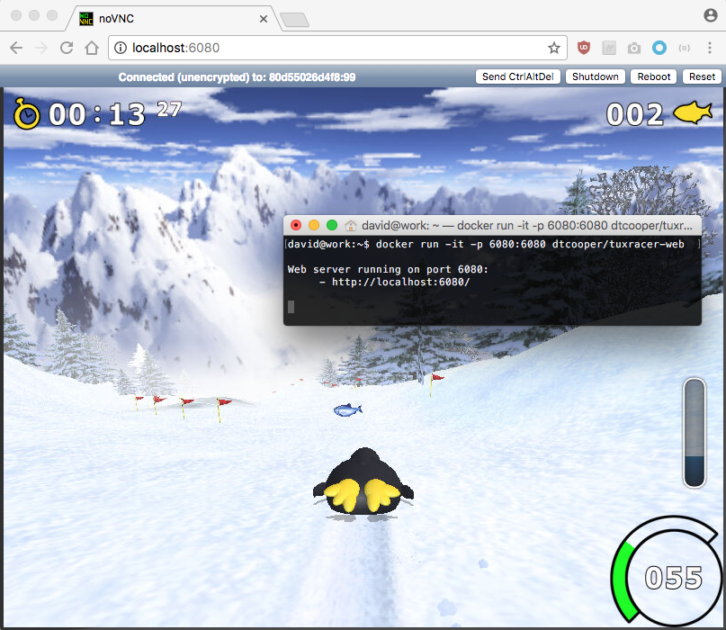

# Tux Racer In Your Browser (In a Headless Docker Container)

Run [Extreme Tux Racer](https://sourceforge.net/projects/extremetuxracer/) in a
Docker container and play it via a websocket <> VNC bridge in your browser.

Why? _Because you can!_ ¯\\\_(ツ)\_/¯

## Running (Easy Peasy)

Run the Docker container exposing port `6080`,

```
docker run -it -p 6080:6080 dtcooper/tuxracer-web
```

Then navigate to http://localhost:6080/ in your web browser, et voilà! You can
play Extreme Tux Racer!

## Screenshot



## Additional Info

### Configuration

You shouldn't _need_ to configure this ridiculous piece of software, but if you
want to it's as easy as setting one of the following environment variables,

* `RESOLUTION` - Resolution, in `<WIDTH>x<HEIGHT>` format, by default `800x600`.
  - Note the larger this is, the slower the container may run.
* `PASSWORD` - VNC password, by default there is none.
* `VERBOSE` - If set to `1`, spew out log information at the terminal.

For example, the following runs at `1024x768` resolution, sets the VNC password
to `himom`, and prints verbose log information,

```
docker run -it -p 6080:6080 \
        -e RESOLUTION=1024x768 \
        -e PASSWORD=himom \
        -e VERBOSE=1 \
    dtcooper/tuxracer-web
```

### Running a Program In The Container

If you for some reason want a shell or to run a program inside of the container,
provide it as an argument. For example to shell into `bash`

```
docker run -it -p 6080:6080 dtcooper/tuxracer-web bash
```

## Building The Container Yourself

Clone this repo and build the container,

```
git clone https://github.com/dtcooper/tuxracer-web
cd tuxracer-web
docker build -t tuxracer-web .
```

Finally run it,

```
docker run -it -p 6080:6080 tuxracer-web
```

That's it!

## License

This project is licensed under the MIT License - see the [`LICENSE`](LICENSE)
file for details.
